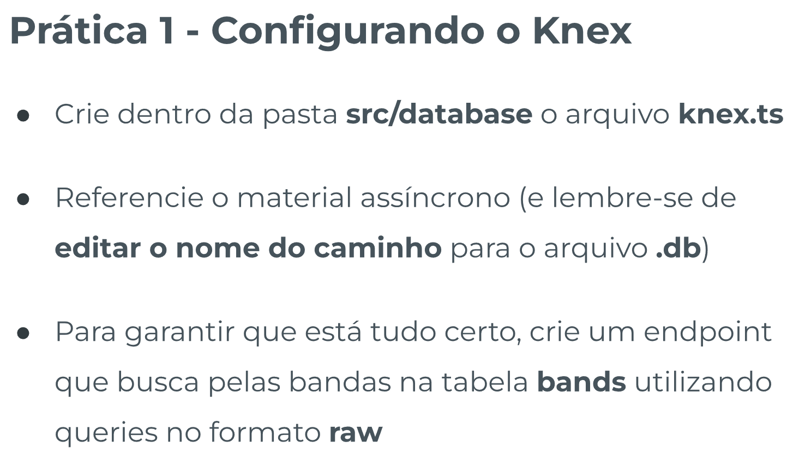
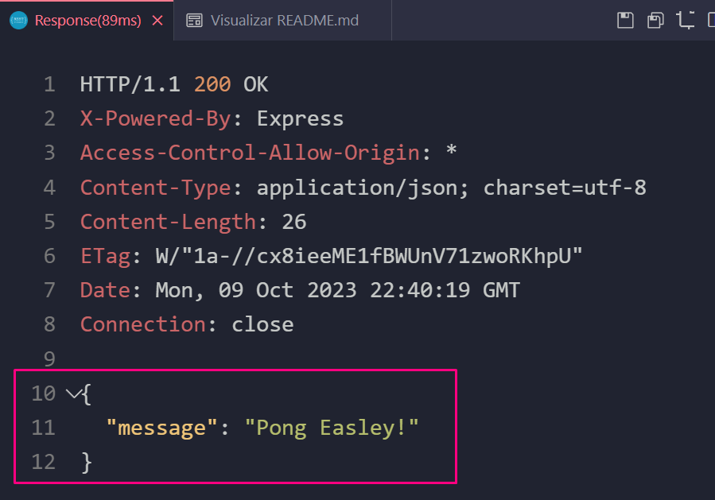
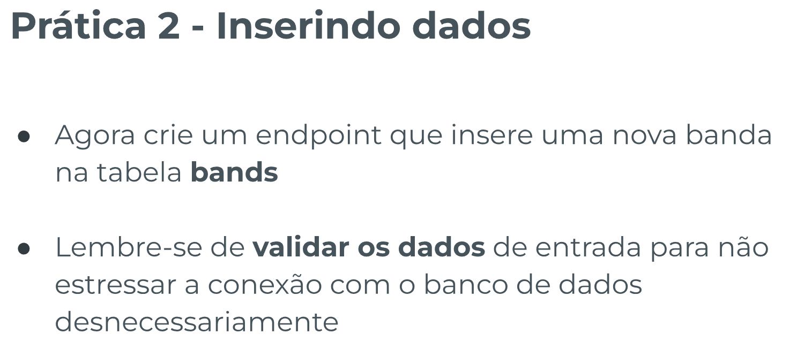
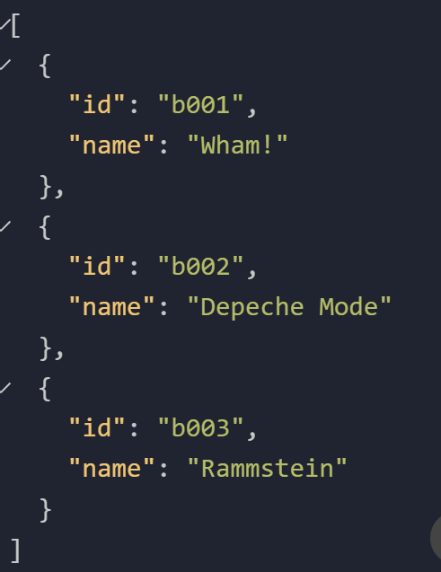
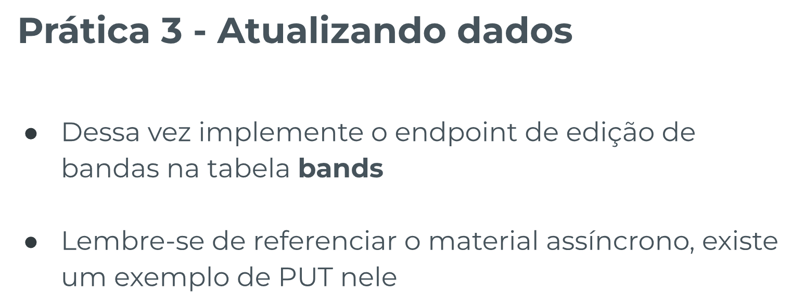
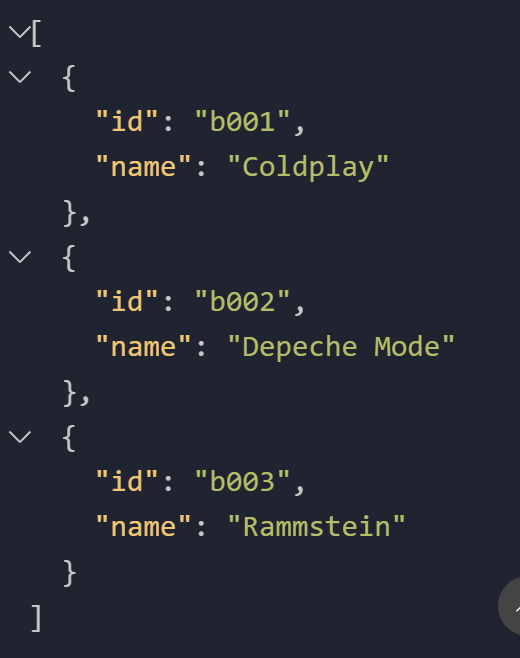
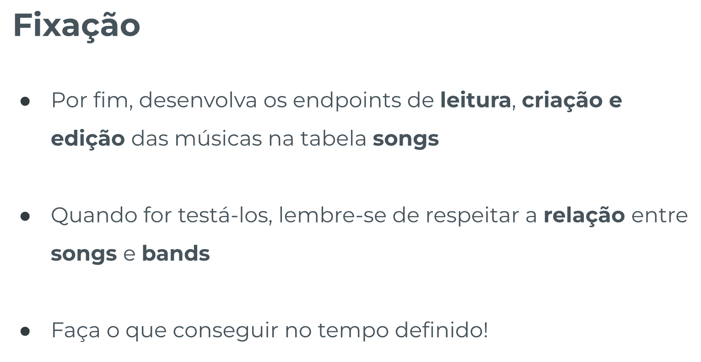
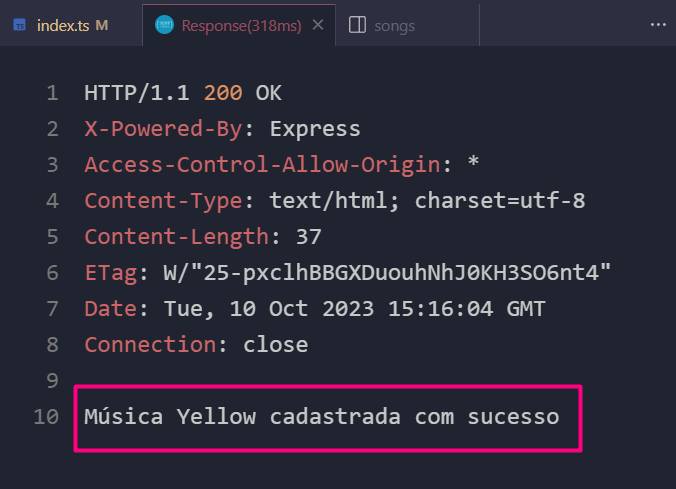
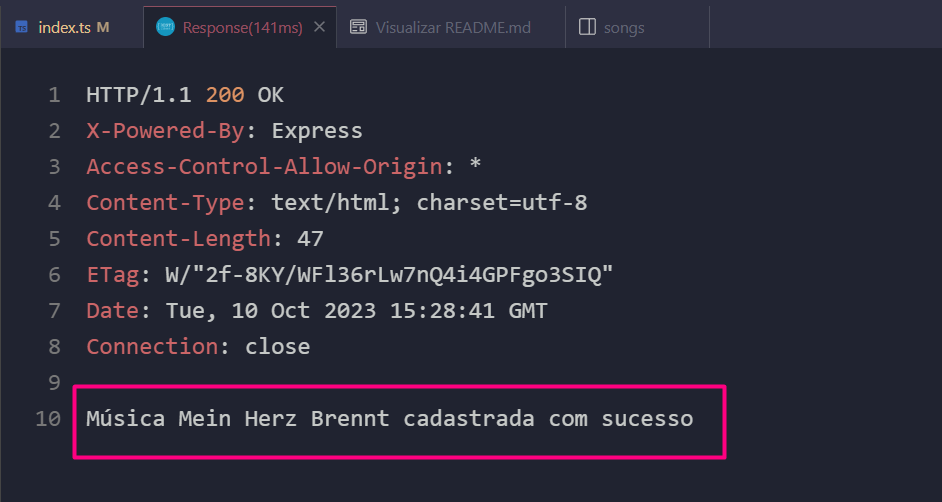
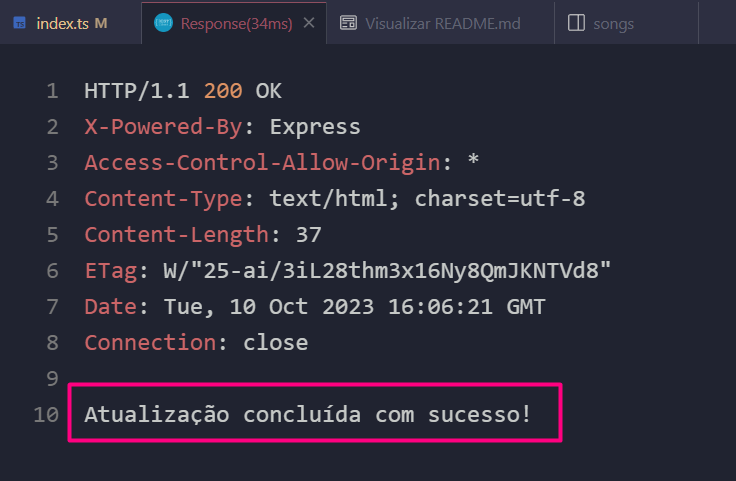

# Introdução ao Knex - Template de Prática

## Índice

-   [Prática Guiada 1](#prática-guiada-1)

    -   [Enunciado](#enunciado)
    -   [Resolução](#resolução)

-   [Prática Guiada 2](#prática-guiada-2)

    -   [Enunciado](#enunciado-1)
    -   [Resolução](#resoluc3a7c3a3o-1)

-   [Prática Guiada 3](#prática-guiada-3)

    -   [Enunciado](#enunciado-2)
    -   [Resolução](#resoluc3a7c3a3o-2)

-   [Fixação](#fixação)

    -   [Enunciado](#enunciado-3)
    -   [Resolução](#resoluc3a7c3a3o-3)

## Prática Guiada 1

[Voltar ao Topo](#índice)

### Enunciado:



### Resolução:

`knex.ts`

```ts
import { knex } from 'knex';

export const db = knex({
    client: 'sqlite3',
    connection: {
        filename: './src/database/introducao-knex.db',
    },
    useNullAsDefault: true,
    pool: {
        min: 0,
        max: 1,
        afterCreate: (conn: any, cb: any) => {
            conn.run('PRAGMA foreign_keys = ON', cb);
        },
    },
});
```

`request.rest`

Criei um arquivo chamado `request.rest` para utilizá-lo como atalho para bater nos endpoints, dentro dele o seguinte código:

```
GET http://localhost:3003/ping
###
```

RESULTADO:


`index.ts`

```ts
// PRÁTICA 1
app.get('/bands', async (req: Request, res: Response) => {
    try {
        const result = await db.raw(`SELECT * FROM bands`);
        res.status(200).send(result);
    } catch (error: any) {
        if (req.statusCode === 200) {
            res.status(500);
        }
        if (error instanceof Error) {
            res.send(error.message);
        } else {
            res.send('Erro inesperado');
        }
    }
});
```

`request.rest`

```
GET http://localhost:3003/bands
###
```

RESULTADO:
Um array vazio, porque nãa há conteúd e todo arquivo `.db` retorna um array, seja ele vazio o não.

## Prática Guiada 2

[Voltar ao Topo](#índice)

### Enunciado:



### Resolução:

`index.ts`

```ts
app.post('/bands', async (req: Request, res: Response) => {
    try {
        const id = req.body.id;
        const name = req.body.name;
        // const { id, name } = req.body;

        if (!id || !name) {
            //undefined
            res.status(400);
            throw new Error('id ou name invalido!');
        }

        await db.raw(`INSERT INTO bands
            VALUES("${id}", "${name}")
        `);

        res.status(200).send('Banda Cadastrada!');
    } catch (error: any) {
        if (req.statusCode === 200) {
            res.status(500);
        }

        if (error instanceof Error) {
            res.send(error.message);
        } else {
            res.send('Erro inesperado');
        }
    }
});
```

`request.rest`

```

POST http://localhost:3003/bands
Content-Type: application/json

{
    "id": "b001",
    "name": "Wham!"
}
###

POST http://localhost:3003/bands
Content-Type: application/json

{
    "id": "b002",
    "name": "Depeche Mode"
}
###

POST http://localhost:3003/bands
Content-Type: application/json

{
    "id": "b003",
    "name": "Rammstein"
}
###

```

> ATENÇÃO: MANTER A LINHA EM BRANCO ANTES DA CHAVE!!!

RESULTADO:


## Prática Guiada 3

[Voltar ao Topo](#índice)

### Enunciado:



### Resolução:

`index.ts`

```ts
app.put('/bands/:id', async (req: Request, res: Response) => {
    try {
        const id = req.params.id;

        const newId = req.body.newId;
        const newName = req.body.newName;

        //console.log(id, newId, newName);

        if (newId !== undefined) {
            if (typeof newId !== 'string') {
                res.status(400);
                throw new Error('Id deve ser uma string');
            }

            if (newId.length !== 4) {
                throw new Error('O id deve ter 4 caracteres');
            }
        }

        if (newName !== undefined) {
            if (typeof newName !== 'string') {
                res.status(400);
                throw new Error('O name deve ser uma string');
            }

            if (newName.length < 2) {
                throw new Error('O name deve ter no mínimo 2 caracteres');
            }
        }

        const [band] = await db.raw(`SELECT * FROM bands WHERE id = "${id}"`);

        if (band) {
            //undefined
            await db.raw(`
                UPDATE bands SET
                id = "${newId || band.id}", name = "${newName || band.name}"
                WHERE id = "${id}"
            `);
        } else {
            res.status(400);
            throw new Error('Id não encontrado!');
        }

        res.status(200).send('Edição feita com sucesso!');
    } catch (error: any) {
        if (req.statusCode === 200) {
            res.status(500);
        }

        if (error instanceof Error) {
            res.send(error.message);
        } else {
            res.send('Erro inesperado');
        }
    }
});
```

`resquest.rest`

```
PUT http://localhost:3003/bands/b001
Content-Type: application/json

{
    "newName": "Coldplay"
}
###
```

RESULTADO:


## Fixação

[Voltar ao Topo](#índice)

### Enunciado:



### Resolução:

#### READ

`index.ts`

```ts
// FIXAÇÃO

// 📌 READ:
app.get('/songs', async (req: Request, res: Response) => {
    try {
        const result = await db.raw(`SELECT * FROM songs`);
        res.status(200).send(result);
    } catch (error: any) {
        if (req.statusCode === 200) {
            res.status(500);
        }

        if (error instanceof Error) {
            res.send(error.message);
        } else {
            res.send('Erro inesperado');
        }
    }
});
```

`request.rest`

```
GET http://localhost:3003/songs
###
```

#### CREATE

`index.ts`

```ts
// 📌 CREATE:
app.post('/songs', async (req: Request, res: Response) => {
    try {
        // recebendo infos do body:
        const { id, name, band_id } = req.body;
        // verificando se campos acima não estão vazios:
        if (!id || !name || !band_id) {
            res.status(400);
            throw new Error('id, name ou band_id inválidos!');
        }
        // verificando se 'band_id' corresponde a algum id de 'bands':
        const [band] = await db.raw(
            `SELECT * FROM bands WHERE id = "${band_id}"`
        );
        if (!band) {
            res.status(400);
            throw new Error(
                'Band_id não corresponde a nenhuma banda existente!'
            );
        }
        // passando na verificação acima vou fazer a inserção no banco de dados:
        await db.raw(`INSERT INTO songs
            VALUES("${id}", "${name}", "${band_id}")
        `);
        // lançando a resposta:
        res.status(200).send(`Música ${name} cadastrada com sucesso`);
    } catch (error: any) {
        if (req.statusCode === 200) {
            res.status(500);
        }
        if (error instanceof Error) {
            res.send(error.message);
        } else {
            res.send('Erro inesperado');
        }
    }
});
```

`request.rest`

```
POST http://localhost:3003/songs
Content-Type: application/json

{
    "id": "s001",
    "name": "Yellow",
    "band_id": "b001"
}
###
```

`Response`


`request.rest`

```
POST http://localhost:3003/songs
Content-Type: application/json

{
    "id": "s002",
    "name": "Mein Herz Brennt",
    "band_id": "b003"
}
###
```

`Response`


#### UPDATE:

`index.ts`

```ts
// 📌 UPDATE:
app.put('/songs/:id', async (req: Request, res: Response) => {
    try {
        // --
        // Relembrando outras formas:
        // const id = req.params.id;
        // const newId = req.body.newId;
        // const newName = req.body.newName;
        // --
        const { id, newId, newName, newBandId } = req.body;
        if (newId !== undefined) {
            // verificando se newId é diferente de string:
            if (typeof newId !== 'string') {
                res.status(400);
                throw new Error('Id deve ser uma string');
            }
            // verificando se newId possui um tamanho diferente de 4 caracteres:
            if (newId.length !== 4) {
                throw new Error('O id deve ter 4 caracteres');
            }
        }
        if (newName !== undefined) {
            // verificando se newName é diferente de string:
            if (typeof newName !== 'string') {
                res.status(400);
                throw new Error('O name deve ser uma string');
            }
            // verificando se newName possui menos de 2 caracteres:
            if (newName.length < 2) {
                throw new Error('O name deve ter no mínimo 2 caracteres');
            }
        }
        if (newId !== undefined) {
            // verificando se newId é diferente de string:
            if (typeof newId !== 'string') {
                res.status(400);
                throw new Error('NewId deve ser uma string');
            }
            // verificando se newId possui menos de 2 caracteres:
            if (newName.length !== 4) {
                throw new Error('O newId deve conter 4 caracteres');
            }
            // verificando se o 'newBandId' corresponde a algum id de 'bands':
            const [band] = await db.raw(
                `SELECT * FROM bands WHERE band_id = "${newBandId}"`
            );
            if (!band) {
                res.status(400);
                throw new Error(
                    'Band_id não corresponde a nenhuma banda existente!'
                );
            }
        }
        // verifica se existe song com o id fornecido para poder editá-lo:
        const [song] = await db.raw(`SELECT * FROM songs WHERE id = "${id}"`);
        if (song) {
            // Se houver song com o id fornecido faz as edições:
            await db.raw(`
            UPDATE songs SET
            id = "${newId || song.id}", name = "${
                newName || song.name
            }", song_id = "${newBandId || song.band_id}"
            WHERE id = "${id}"
            `);
        }
        res.status(200).send('Atualização concluída com sucesso!');
    } catch (error: any) {
        if (req.statusCode === 200) {
            res.status(500);
        }
        if (error instanceof Error) {
            res.send(error.message);
        } else {
            res.send('Erro inesperado');
        }
    }
});
```

`request.rest`

```
PUT http://localhost:3003/songs/s004
Content-Type: application/json

{
    "newName": "Enjoy the Silence!"
}
###
```

`Response`


